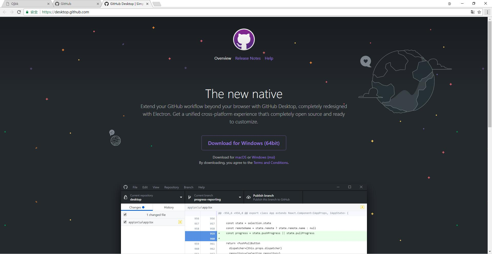
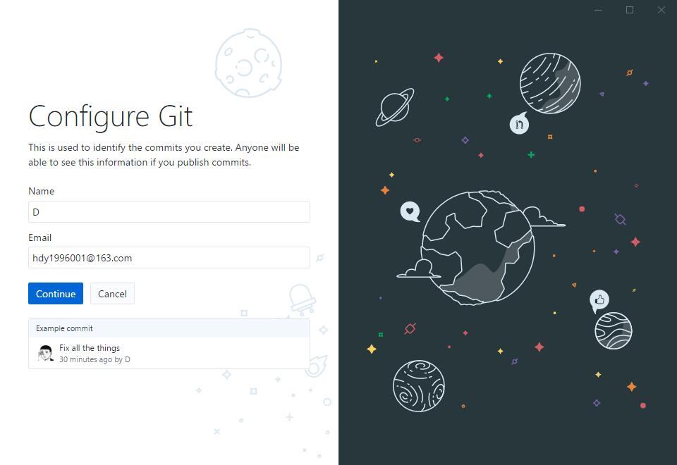
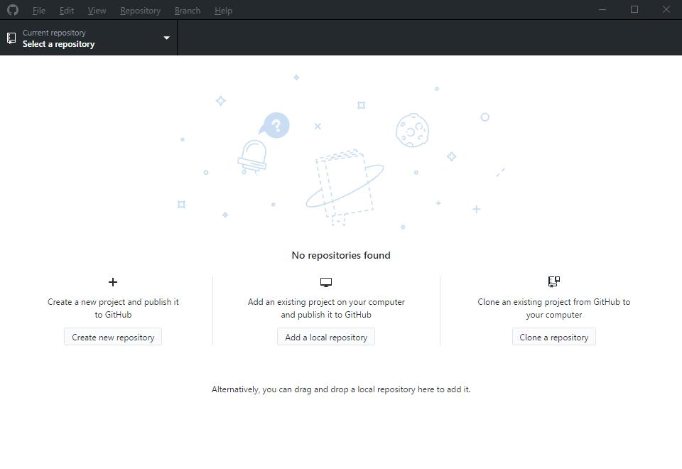
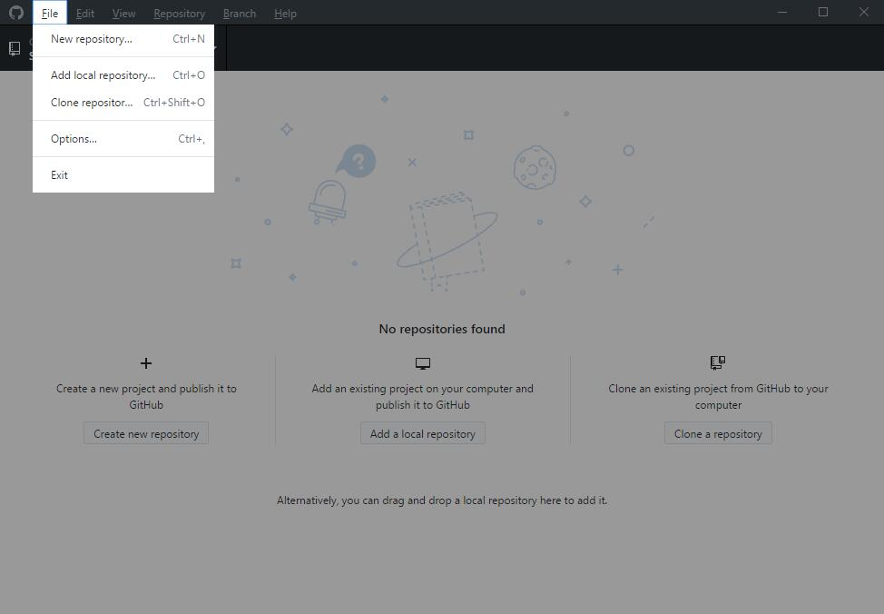
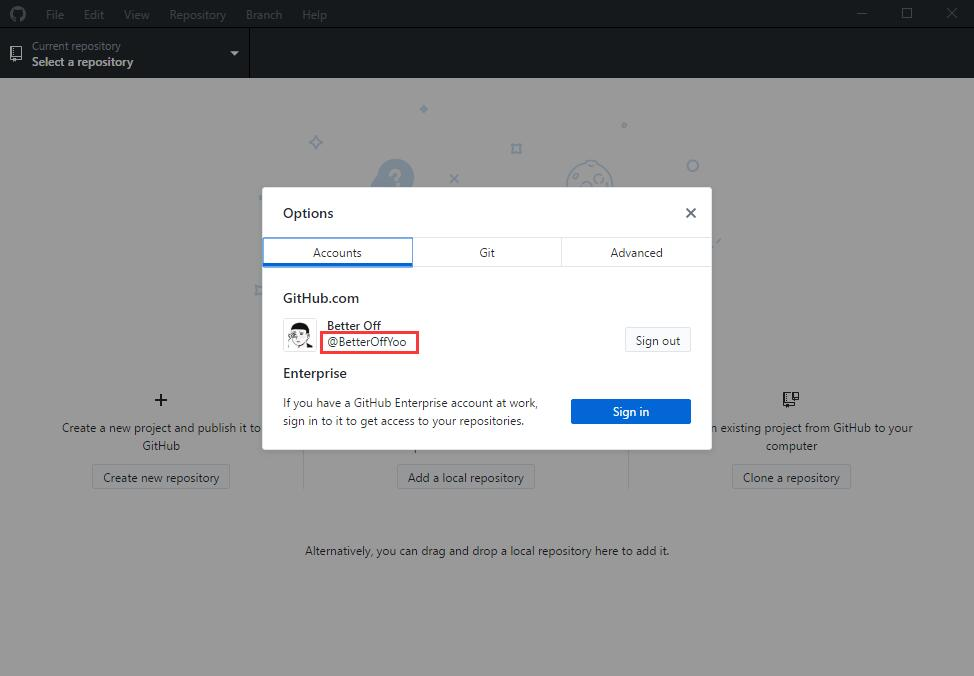
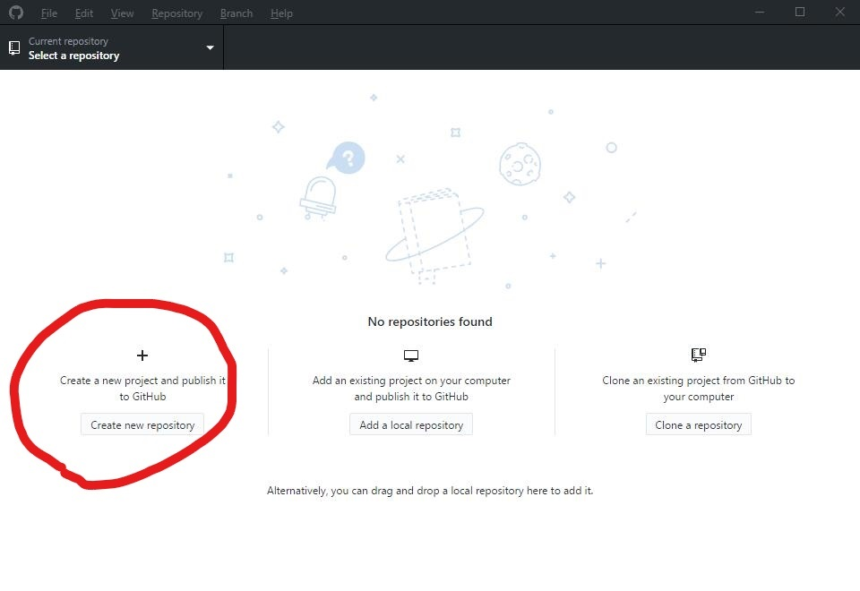
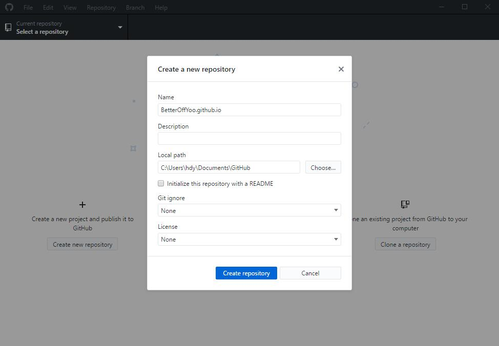
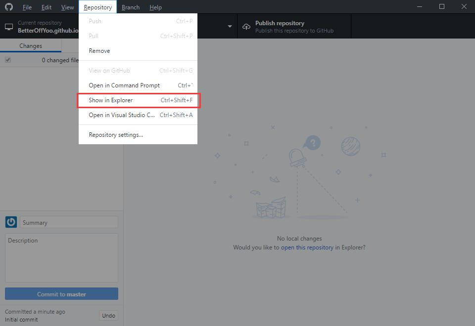
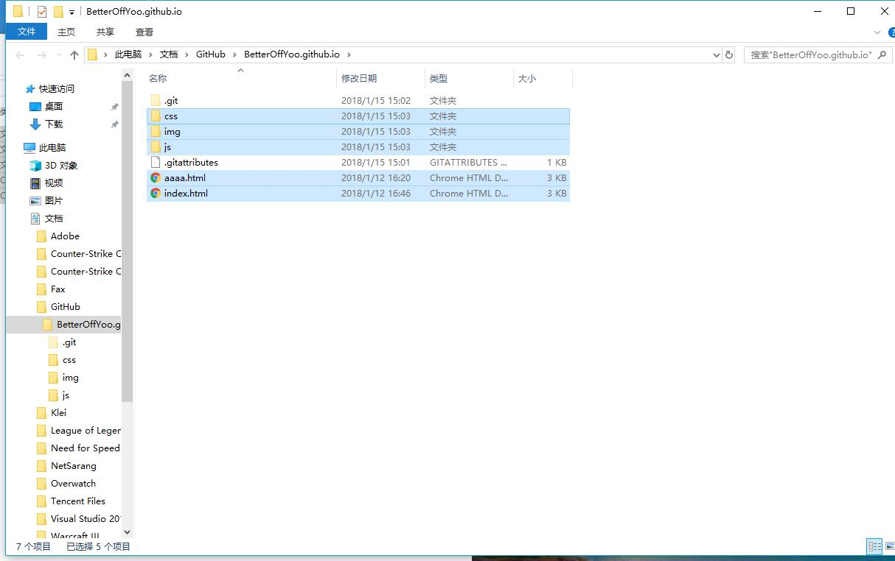
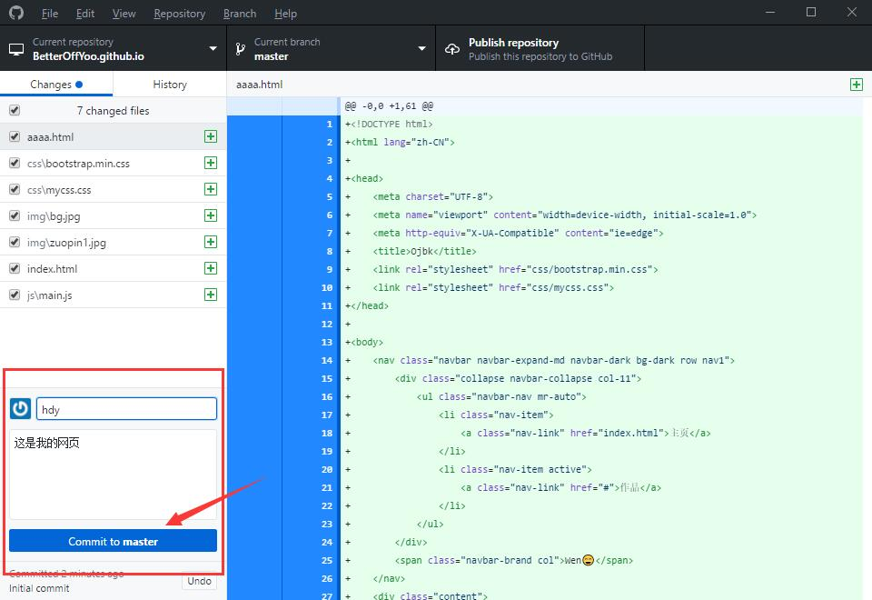

# 教程

1. 下载安装 [Github Desktop](https://desktop.github.com/)

2. 下载后双击打开

- 如果没有注册过 Github 账号，可以点击 *Create your free account* 进行创建
- 注册过之后，点击上图中的 *Sign into Github.com*

3. 登陆并点击 *Continue*

登陆后到达下图界面

4. 查看自己的用户名，在左上角 File - Options...

- 可以看到自己的用户名为 @ 后面内容

5. 创建一个 *自己用户名.github.io* 的仓库，如我的用户名为 *BetterOffYoo* ，则创建仓库名为 *BetterOffYoo.github.io*

6. 创建之后，点击 Repository - Show in Explorer 可以看到创建的仓库的文件夹，并把自己的网页复制到这个文件夹。

7. 这时候程序中就会有相应的变化，此时左下角填写概要和描述，并点击 *Commit* 提交

8. 提交后点击 Publish repository 来发布即可

9. 最后就可以通过 https://你的用户名.github.io/xxx.html 来访问你的网页啦！